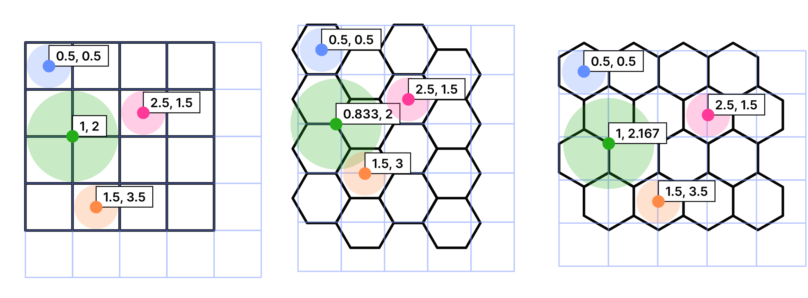

Common classes to create and convert between square grids and hexagonal grids.

Conversion is achieved with a bidirectional function which takes a point and transforms it using either `gridToWorldSpace( point )` or `worldToGridSpace( point )`.

```dart
final grid = Grid.square(
    4,                // 4 tiles in each "row" in world space
    zero: Point(0, 0) // Grid origin in world space
    size: Point(4, 4) // Grid size in world space
);

// Alternatives with hexagonal grid
Grid.hexagonal(4, horizontal: true);
Grid.hexagonal(4, horizontal: false);

// Examples: Grid -> World space
grid.gridToWorldSpace( Point(0.5, 0.5) ); // Blue dot in figure
grid.gridToWorldSpace( Point(1,   2  ) ); // Green
grid.gridToWorldSpace( Point(2.5, 1.5) ); // Pink
grid.gridToWorldSpace( Point(1.5, 3.5) ); // Orange
```

The following figure exemplifies the correlation between grid space and world space for each available grid type.

Transformations in a **_square_** grid, **_horizontal hex_** grid and **_vertical hex_** grid.
